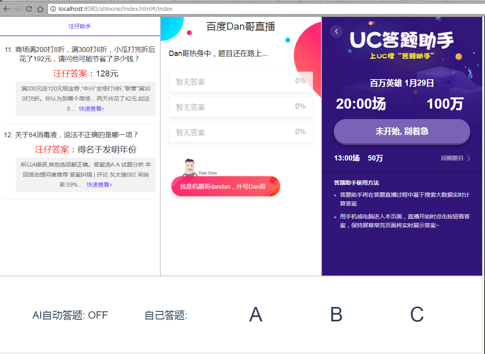

# autoAnswer

和简单搜索、汪仔助手、UC答题助手一起答题。

- 为什么要做这个？

西瓜视频目前不支持分屏应用，得用两个手机，一个看答案一个答题。这个项目可以让这些助手在电脑上运行。

- 为什么要采用hack客户端的方式？

直接调用Api获取数据要先分析整个鉴权认证过程（模拟cookies，sessionId，和一些不知道的XXId）。客户端模拟的方式去开发，能够快速实现需求：抓到需要的数据。

后续会采用Scrapy爬虫，直接抓即结果。

- AI如何自动化处理西瓜视频的个性化题？

目前的做法是收到答案后，子进程并行截图OCR识别答案，同时主进程不断接收答案。在OCR完成后，计算出优选答案，点击不同的设备。

## before start

#### 1. 确保正常的python3环境，并安装pytesseract

`pip install pytesseract`

#### 2. 安装 ADB，确保执行adb device能出现您的设备

下载地址：https://adb.clockworkmod.com/ ，并配置环境变量

#### 3. 安装 谷歌 Tesseract

Windows下链接： 推荐使用安装版，在安装时选择增加中文简体语言包

安装版：https://digi.bib.uni-mannheim.de/tesseract/tesseract-ocr-setup-3.05.01.exe

免安装版： https://github.com/parrot-office/tesseract/releases/download/3.5.1/tesseract-Win64.zip 免安装版需要下载中文语言包，放置到Tesseract的tessdata目录下

其他系统： https://github.com/tesseract-ocr/tesseract/wiki

## start

完成所有 before start

PS：注意根据需要，修改screen.conf中的分辨率，默认三星Note8的2K。

+ 1、连接手机adb（可选，如果需要AI答题）

+ 2、开启Py的Sever做静态托管和反向代理。浏览器打开 localhost:8080

  `py server.py`

+ 3、数据分析开发中...

## update log

20180131: 用sqlit3保存AI答题的结果

20180127: http接口改为标准JSON-String通讯。删除基本上没用的单独AI助手

20180126: 增加控制器层，抽离逻辑代码。添加adb未连接的提示，添加截图分析选项的功能

20180125: 重构Python代码，为后续功能挖坑（预留能力）

20180122: sogou的api更新，样式更新

20180120: python服务器支持反向代理，去除nginx

## roadmap

+ ~~1、完成AI自动答题的逻辑，将缓存的答案用mapReduce的形式转为最佳答案。~~ 20180129 完成 √

+ 2、用sqlite3存储结果，用图表展示各个AI助手的表现

+ 3、用爬虫直接抓取AI答题的结果

+ 4、添加百度搜索的结果用放在界面旁展示

## thanks

截图和OCR代码参考[https://github.com/Skyexu/TopSup](https://github.com/Skyexu/TopSup)

